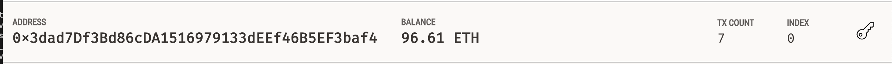
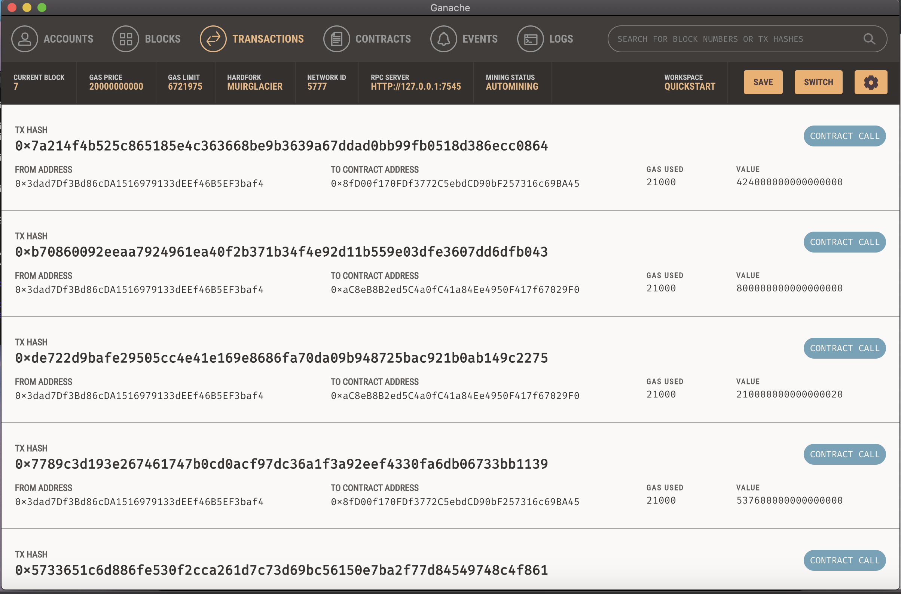
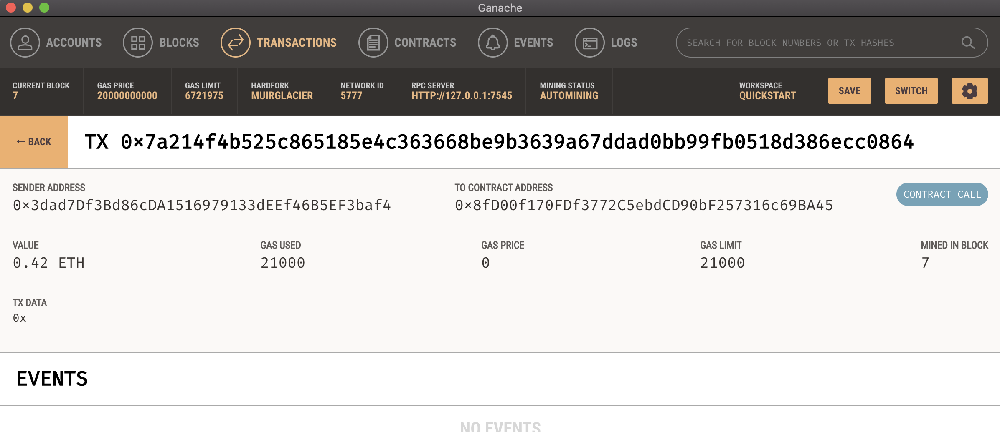

# Challenge-19
**The purpose of this challenge is to complete the code that enables your customers to send cryptocurrency payments to fintech professionals.**

## Address Balance

## Transaction Detail

## Contract Call

*Please note: We reviewed Ganache in class and not Kovan, so all of my screenshots are provided by Ganache*
